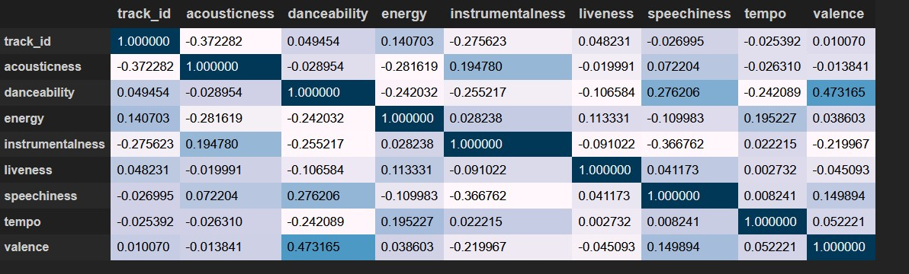
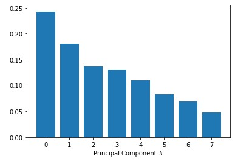
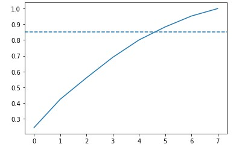

<h3 align='center'>Classify Song Genres from Audio Data<br>Rock or rap?</h3><hr>


 

<!-- <p align='center'>
  
</p> -->

<h3>1. Preparing our dataset</h3>
<p>    Over the past few years, streaming services with huge catalogs have become the primary means through which most people listen to their favorite music. For this reason, streaming services have looked into means of categorizing music to allow for personalized recommendations.<br><br>Let's load the metadata about our tracks alongside the track metrics compiled by <b>The Echo Nest</b>.</p>

```python
import pandas as pd

tracks = pd.read_csv('datasets/fma-rock-vs-hiphop.csv')
echonest_metrics = pd.read_json('datasets/echonest-metrics.json', precise_float=True)

# Merge the relevant columns of tracks and echonest_metrics
echo_tracks = pd.merge(echonest_metrics, tracks[['track_id' , 'genre_top']], how='inner', on='track_id')

# Inspect the resultant dataframe
echo_tracks.info()
```
|   Int64Index: 4802 entries, 0 to 4801   |                       |
|:---------------------------------------:|:---------------------:|
|     Data columns (total 10 columns):    |                       |
|               acousticness              | 4802 non-null float64 |
|               danceability              | 4802 non-null float64 |
|                  energy                 | 4802 non-null float64 |
|             instrumentalness            | 4802 non-null float64 |
|                 liveness                | 4802 non-null float64 |
|               speechiness               | 4802 non-null float64 |
|                  tempo                  | 4802 non-null float64 |
|                 track_id                | 4802 non-null int64   |
|                 valence                 | 4802 non-null float64 |
|                genre_top                | 4802 non-null object  |
| dtypes: float64(8), int64(1), object(1) |                       |
|         memory usage: 412.7+ KB         |                       |


<h3>2. Pairwise relationships between continuous variables</h3>
<p>We want to avoid using variables that have strong correlations with each other -- hence avoiding feature redundancy<br>To get a sense of whether there are any strongly correlated features in our data, we will use built-in functions in the <code>pandas</code> package <code>.corr()</code>. </p>

```python
corr_metrics = echo_tracks.corr()
corr_metrics.style.background_gradient()
```
<p align='center'>
  
</p>

<h3>3. Normalizing the feature data</h3>
<p>Since we didn't find any particular strong correlations between our features, we can instead use a common approach to reduce the number of features called <b>principal component analysis (PCA)</b><br>To avoid bias, I first normalize the data using <code>sklearn</code> built-in <code>StandardScaler</code> method</p>

```python
from sklearn.preprocessing import StandardScaler

features = echo_tracks.drop(['track_id', 'genre_top'], axis=1)
labels = echo_tracks.genre_top

scaler = StandardScaler()
scaled_train_features = scaler.fit_transform(features)
```

<h3>4. Principal Component Analysis on our scaled data</h3>
<p>Now PCA is ready to determine by how much we can reduce the dimensionality of our data. We can use <b>scree-plots</b> and <b>cumulative explained ratio plots</b> to find the number of components to use in further analyses.<br>When using scree plots, an 'elbow' (a steep drop from one data point to the next) in the plot is typically used to decide on an appropriate cutoff.</p>
  
```python
from sklearn.decomposition import PCA

pca = PCA()
pca.fit(scaled_train_features)

exp_variance = pca.explained_variance_ratio_

fig, ax = plt.subplots()
ax.bar(range(pca.n_components_), exp_variance)
```



<p>Unfortunately, there does not appear to be a clear elbow in this scree plot, which means it is not straightforward to find the number of intrinsic dimensions using this method.</p>

<h3>5. Further visualization of PCA</h3>
<p>Let's nownlook at the <b>cumulative explained variance plot</b> to determine how many features are required to explain, say, about 85% of the variance</p>

```python
cum_exp_variance = np.cumsum(exp_variance)

fig, ax = plt.subplots()
ax.plot(cum_exp_variance)
ax.axhline(y=0.85, linestyle='--')

# choose the n_components where about 85% of our variance can be explained
n_components = 6

pca = PCA(n_components, random_state=10)
pca.fit(scaled_train_features)
pca_projection = pca.transform(scaled_train_features)
```



<h3>6. Train a decision tree to classify genre</h3>
<p>Now we can use the lower dimensional PCA projection of the data to classify songs into genres. we will be using a simple algorithm known as a <b>decision tree</b>.</p>

```python
from sklearn.model_selection import train_test_split
from sklearn.tree import DecisionTreeClassifier

train_features, test_features, train_labels, test_labels = train_test_split(pca_projection, labels, random_state=10)

tree = DecisionTreeClassifier(random_state=10)
tree.fit(train_features, train_labels)

pred_labels_tree = tree.predict(test_features)
```

<h3>7. Compare our decision tree to a logistic regression</h3>
<p>There's always the possibility of other models that will perform even better! Sometimes simplest is best, and so we will start by applying <b>logistic regression</b>.</p>

```python
from sklearn.linear_model import LogisticRegression
from sklearn.metrics import classification_report

logreg = LogisticRegression(random_state=10)
logreg.fit(train_features, train_labels)
pred_labels_logit = logreg.predict(test_features)

class_rep_tree = classification_report(test_labels, pred_labels_tree)
class_rep_log = classification_report(test_labels, pred_labels_logit)

print("Decision Tree: \n", class_rep_tree)
print("Logistic Regression: \n", class_rep_log)
```

| Decision Tree: |        |          |         |      |  
|----------------|--------|----------|---------|------|
| precision      | recall | f1-score | support |      |
| Hip-Hop        | 0.66   | 0.66     | 0.66    | 229  |
| Rock           | 0.92   | 0.92     | 0.92    | 972  |
| avg / total    | 0.87   | 0.87     | 0.87    | 1201 |

| Logistic Regression: |        |          |         |      |
|----------------------|--------|----------|---------|------|
| precision            | recall | f1-score | support |      |
| Hip-Hop              | 0.75   | 0.57     | 0.65    | 229  |
| Rock                 | 0.90   | 0.95     | 0.93    | 972  |
| avg / total          | 0.87   | 0.88     | 0.87    | 1201 | 


<h3>8. Using cross-validation to evaluate our models</h3>
<p>To get a good sense of how well our models are actually performing, we can apply what's called <b>cross-validation</b> (CV).

```python
from sklearn.model_selection import KFold, cross_val_score

kf = KFold(n_splits=10)

tree = DecisionTreeClassifier(random_state=10)
logreg = LogisticRegression(random_state=10)

tree_score = cross_val_score(tree,pca_projection, labels, cv=kf)
logit_score = cross_val_score(logreg,pca_projection, labels, cv=kf)

print("Decision Tree:", tree_score)
>>> Decision Tree: [0.6978022  0.6978022  0.69230769 0.78571429 0.71978022 0.67032967 0.75824176 0.76923077 0.75274725 0.6978022 ]
print("Logistic Regression:", logit_score)
>>> Logistic Regression: [0.79120879 0.76373626 0.78571429 0.78571429 0.78571429 0.78021978 0.75274725 0.76923077 0.81868132 0.71978022]
```

<h4> Success! </h4>
